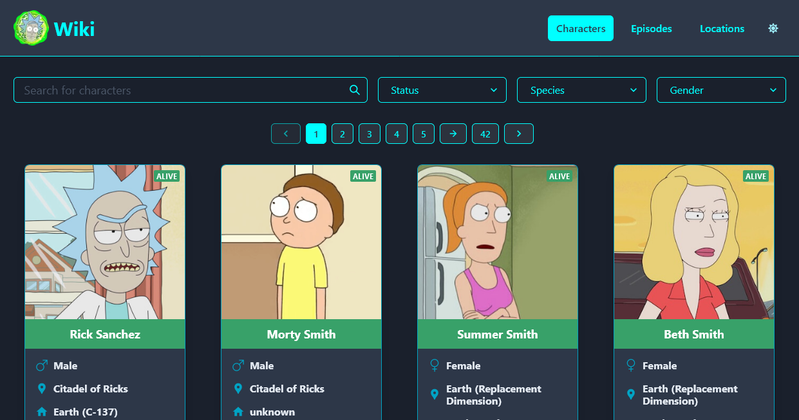

  <h1>Rick & Morty Wiki</h1>
  

  
Simple project that fetchs and shows data from the
  <a href="https://rickandmortyapi.com">Rick and Morty Community API</a>
  open source and under the BSD License. The interface was made using React.js, Next.js and ChakraUI component library.

  

## Demo: [Rick & Morty Wiki][rick_morty_wiki]

## :white_check_mark: Features

- Light/Dark mode

- Characters

  - Seach by name
  - Filter by status, gender and species

- Episodes

  - Filter characters by episode

- Locations
  - Filter characters by location

## :computer: Running

Go to the project root and install dependencies with the `yarn`.

Then run it locally in port `3000` with the `yarn dev`.

## :crystal_ball: Tech

- [Next.js][next]
- [Typescript][typescript]
- [ChakraUI][chakra]
- [Axios][axios]
- [react-icons][react_icons]
- [usehooks-ts][usehooks_ts]

## :page_with_curl: License

This project is under the MIT License - [LICENSE](LICENSE)

[next]: https://nextjs.org
[typescript]: https://www.typescriptlang.org
[react_icons]: https://react-icons.github.io/react-icons
[chakra]: https://chakra-ui.com
[usehooks_ts]: https://www.npmjs.com/package/usehooks-ts
[choc_ui_paginator]: https://choc-ui.tech/docs/packages/pagination
[axios]: https://axios-http.com/docs/intro
[rick_morty_api]: https://rickandmortyapi.com
[rick_morty_wiki]: https://rick-wiki.vercel.app
